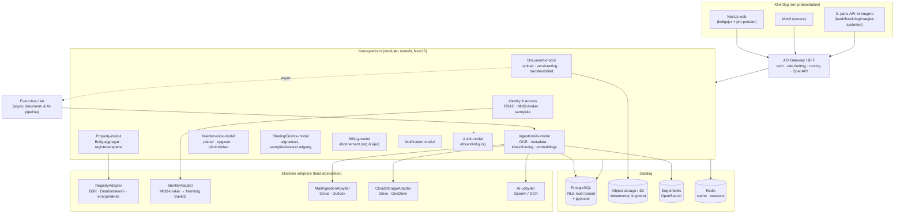
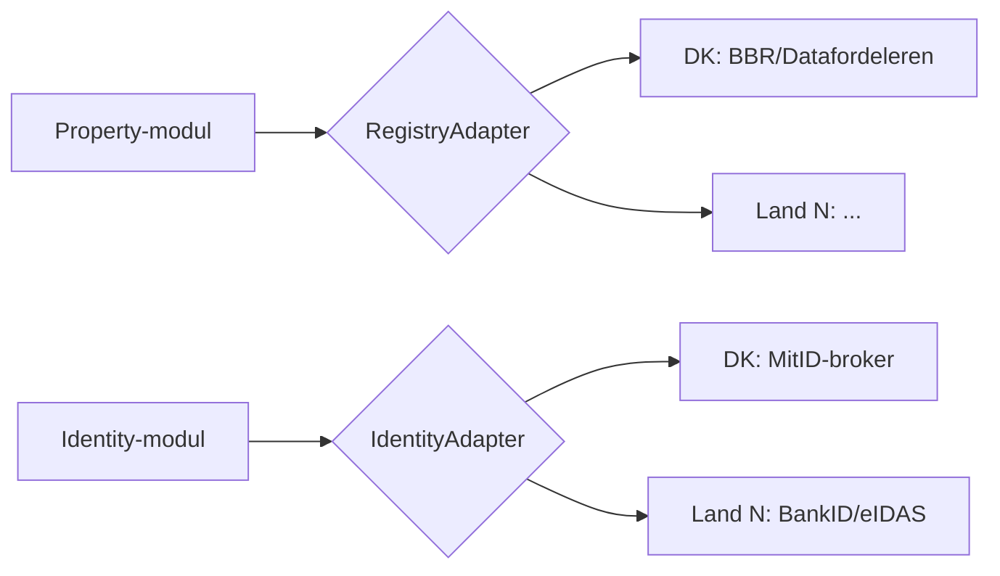
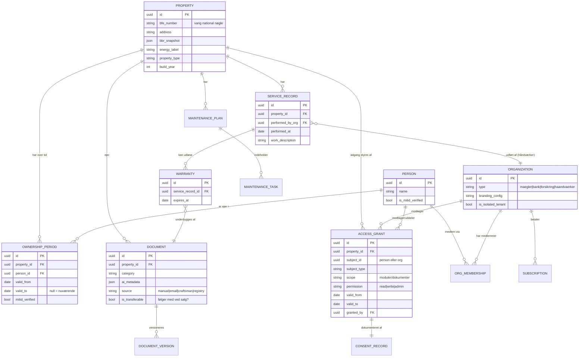
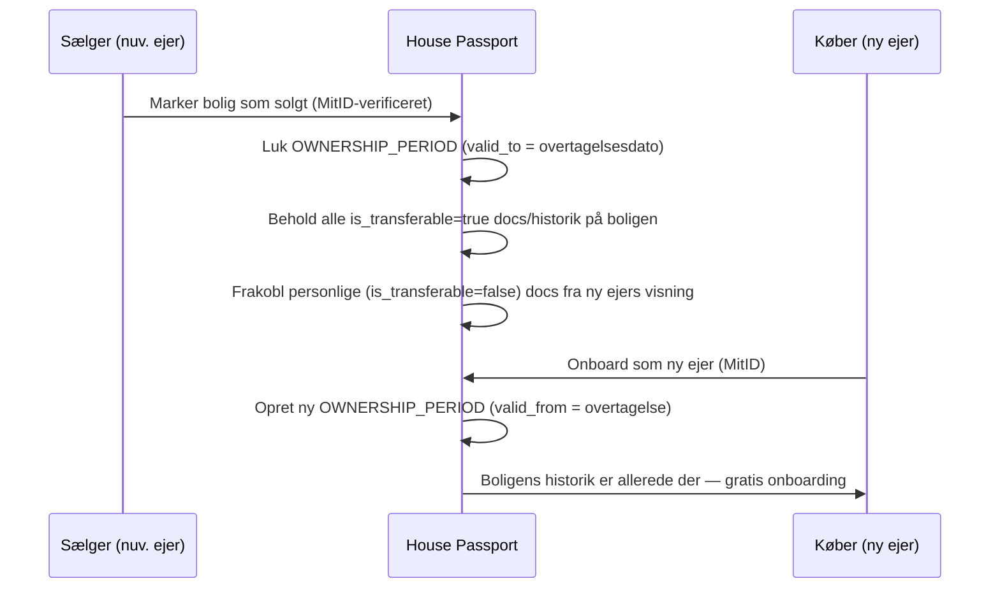

# House Passport — Trin 4–5
## Systemarkitektur · Domænemodel

> Leverance 2 af 17. Dimensioneret til **1 mio.+ boliger** og **10 mio.+ dokumenter**.
> Bygget på de to strategiske valg fra Trin 1–3:
> **(A)** Arkitekturen holder *både* uafhængig-venture- og branchealliance-vejen åben.
> **(B)** Multi-tenancy er *hybrid*: både husstande/boliger og professionelle organisationer.

---

## 0. Hvordan dine to valg former arkitekturen

| Valg | Arkitektonisk konsekvens |
|---|---|
| **Hold venture/alliance åben** | Håndværker-dataindtag bygges som en **åben, standardiseret integrationskontrakt**, ikke en lukket egen-flow. White-label/branding ligger i tenant-modellen fra dag ét, så en alliancepartner kan køre platformen under eget brand. Dataejerskab holdes rent, så en fremtidig JV-/alliancestruktur er mulig uden migration. |
| **Hybrid tenant** | Vi gør **ikke** husstanden til en SaaS-tenant. Boligen er den varige kerneentitet; ejerskab er en tidsrelation; professionelle organisationer er klassiske tenants med afgrænset, samtykkebaseret adgang. Isolation håndteres ens (pooled + RLS) for begge typer, med "promote-to-isolated" for store enterprise-kunder. |

Prisen for fleksibilitet er, at adgangsmodellen (AccessGrant, §5.3) skal være korrekt fra start. Den kan ikke eftermonteres billigt.

---

# TRIN 4 — SYSTEMARKITEKTUR

## 4.1 Arkitekturprincipper

1. **API-first.** Al forretningslogik bag et versioneret REST-API (OpenAPI-kontrakt først). Frontend er ren præsentation. GraphQL-gateway kan lægges ovenpå senere uden at ændre kernen.
2. **Boligen er kernen, ikke brugeren.** Den varige rod-entitet er *Bolig*, ikke *User*. Dette er forudsætningen for ejerskifte-overdragelse (moaten).
3. **Async-først dokumentpipeline.** OCR, metadataudtræk, klassificering og embeddings er langsomme og bursty. Alt dette er event-drevet og idempotent — aldrig synkront i request-tråden.
4. **Pooled multi-tenancy med isolation via RLS.** Én logisk database, tenant-diskriminator, PostgreSQL Row-Level Security. Escape-hatch: en stor enterprise-tenant kan forfremmes til isoleret database uden domæneændringer.
5. **Adaptere ved alle landegrænser.** Registre (BBR/Datafordeleren) og ID (MitID-broker) bag interfaces → internationalisering uden omskrivning.
6. **Modulær monolit før mikroservices.** Klare modulgrænser, der *er* fremtidige servicegrænser — men ét deploybart kerneprodukt indtil skala retfærdiggør opsplitning (se §4.3).
7. **Privacy & audit by design.** Samtykke, kryptering, uforanderlig audit-log og dokumentversionering er tværgående, ikke eftertanker.

## 4.2 Overordnet arkitektur

## 4.3 Nøglebeslutninger (med begrundelse)

**1. Modulær monolit før mikroservices.**
Briefet antyder mange portaler/services. For et lille team i tidlig fase dræber mikroservices fra dag ét hastigheden (distribueret kompleksitet, devops-overhead, transaktionssvær konsistens). Vi bygger NestJS som én deploybar modulær monolit, hvor modulgrænserne er rene nok til senere udskillelse. **Første kandidater til udskillelse**, når trafik kræver det: *Ingestion/AI-modulet* (helt anden skalerings- og omkostningsprofil) og senere *Document-modulet*.

**2. Async, idempotent dokumentpipeline.**
En mægler kan onboarde en bolig med 500 dokumenter på én gang; en e-mailsync kan importere års vedhæftninger. Synkron OCR ville aldrig skalere. Pipeline: `upload → S3 → emit DocumentUploaded → kø → OCR-worker → metadata/klassificering → embeddings (pgvector) → indeksering (OpenSearch) → emit DocumentProcessed`. Hvert trin er idempotent og kan genafspilles. Workers autoskalerer på kølængde.

**3. Pooled multi-tenancy med RLS.**
1 mio.+ husstande gør database-per-tenant eller schema-per-tenant umulig. Én pooled database med `tenant_id`-diskriminator + PostgreSQL RLS, hvor tenant-kontekst sættes pr. request. Enterprise-escape-hatch bevarer alliance-fleksibiliteten. (RLS-implementering har en Prisma-faldgrube — se §4.8.)

**4. pgvector før dedikeret vektordatabase.**
Start embeddings i PostgreSQL via `pgvector` — ét system mindre at drive. Abstrahér bag et `RetrievalService`-interface, så vi kan skifte til en dedikeret vektordatabase, hvis vi passerer ~5–10 mio. vektorer eller får latensproblemer. Undgå præmatur kompleksitet.

**5. Adaptermønster ved registre og identitet.**
`RegistryAdapter` og `IdentityAdapter` isolerer alt landespecifikt. DK-implementering = BBR/Datafordeleren + MitID-broker. Ekspansion = ny adapter-implementering, ikke kernemodifikation.

## 4.4 Multi-tenant isolationsstrategi (hybrid — kerneudfordringen løst)

To tenant-typer, ét isolationsfundament:

| Tenant-type | Eksempel | Isolation | Adgang til boligdata |
|---|---|---|---|
| **Personlig kontekst** (ikke en klassisk tenant) | En husstand omkring en bolig | Adgang styres via **AccessGrant-graf** på boligen, ikke via tenant-skel | Ejer (MitID-verificeret) har fuld ret; kan uddele afgrænset adgang |
| **Organisations-tenant** | Mæglerkæde, bank, forsikring, håndværksvirksomhed | Pooled + RLS på `org_id`; egne brugere, roller, branding, abonnement | Får **afgrænset, tidsbegrænset, samtykkelogget** adgang til konkrete boliger via AccessGrant |

**Den centrale indsigt:** Boligen tilhører ikke en tenant. Den er en delt, ejer-kontrolleret rod. En bank "har" aldrig boligen — den får en *grant*. Det er præcis dét, der gør dataene B2B-værdifulde (de er ejer-verificerede og samtykkebaserede) og samtidig GDPR-holdbare.

## 4.5 Skaleringsanalyse (konkret, mod kravet)

| Dimension | Mål | Vurdering & tiltag |
|---|---|---|
| **Dokumentlagring** | 10 mio. docs × ~2–5 MB = **20–50 TB** | Triviel for S3. Intelligent tiering for kold historik. Pris, ikke teknik, er begrænsningen. |
| **Dokument-metadata** | 10 mio.+ rækker | PostgreSQL klarer dette med partitionering (fx på `property_id`-hash eller tid) + indeksering. |
| **Embeddings (pgvector)** | 10 mio.+ vektorer | Øvre grænse for komfortabel pgvector-drift. Overvåg; ved overskridelse → dedikeret vektordatabase bag `RetrievalService`. |
| **Ingestion-burst** | Mægler/e-mailsync = hundredvis af docs på sekunder | Kø + autoskalerende workers; backpressure; idempotens. |
| **Dashboard-læsninger** | Læsetungt | Redis-cache + read-replicas; materialiserede overblik (fx vedligeholdelsesscore). |
| **Tenant-kardinalitet** | 1 mio.+ personlige kontekster, tusinder af org-tenants | Pooled RLS skalerer; isolation kun for største enterprise-kunder. |

## 4.6 Internationaliserings-abstraktion

Kernen kender kun interfacet. Et nyt land = nye adapter-implementeringer + landekonfiguration. Ingen ændringer i domæne eller forretningslogik.

## 4.7 Tech-stack: bekræftelser og CTO-udfordringer

**Bekræftes fra briefet:** Next.js/React/TS/Tailwind/shadcn (frontend), NestJS/PostgreSQL/Prisma (backend), S3 (storage), AWS (hosting), GitHub Actions (CI/CD), Sentry + Datadog (observability). Solid, ansættelsesvenlig stack.

**Udfordres / skal afgøres senere:**

| Emne | Udfordring | Anbefaling (afgøres i nævnte trin) |
|---|---|---|
| **Auth: Clerk *og* Auth0** | Vælg én. Clerk = hurtig B2C; Auth0 = stærkere enterprise-B2B + ekstern IdP-/broker-føderation. Hybrid tenancy + MitID + enterprise trækker mod Auth0-klassen. | Beslut i **Trin 9**; uanset hvad: føderér MitID-broker, byg ikke selv IdP. |
| **Vektordatabase (separat)** | Præmatur som eget system. | pgvector først; abstrahér; skift kun ved behov. |
| **Prisma + RLS** | Prisma sætter ikke automatisk RLS-session-kontekst; kræver eksplicit `SET app.tenant_id` pr. transaktion/forbindelse. Faldgrube ved connection pooling. | Detaljér i **Trin 6** (database-design) — middleware der sætter tenant-kontekst, testet mod pooler. |
| **Mikroservices** | Undgå tidligt. | Modulær monolit; udskil Ingestion/AI først. |

## 4.8 Arkitekturrisici

1. **RLS-lækage er katastrofal** (én bolig synlig for forkert tenant = tillids- og GDPR-brud). → Tenant-isolation skal have automatiserede negative tests i CI fra dag ét.
2. **AI-pipeline-omkostning** kan løbe løbsk ved 10 mio. docs (OCR + embeddings koster pr. dokument). → Budgettér pr.-dokument-omkostning; cache; kun re-processér ved ændring.
3. **Registeradgang (BBR/Datafordeleren)** kan have latens/rate-limits, der bryder "5-minutters onboarding". → Async pre-fetch + caching; håndtér graciøst, når data mangler.
4. **Eventbus bliver et single point of failure** for ingestion. → Dead-letter-køer, retry med backoff, observability på kølængde.

---

# TRIN 5 — DOMÆNEMODEL

## 5.1 Det bærende princip

> **Boligen er en varig entitet. Ejerskab er en tidsbegrænset relation oven på den. Dokumenter og historik tilhører boligen — ikke brugeren.**

Det er forskellen på en personlig dokumentmappe (dør ved salg) og en boligplatform (vokser i værdi ved hvert salg, fordi mappen følger boligen). Det er fundamentet for både moaten og hybrid-tenancy.

## 5.2 Kerneentiteter

## 5.3 AccessGrant — hjertet i deling og hybrid-tenancy

`AccessGrant` er den ene mekanisme, der håndterer *al* deling — og dermed løser hybrid-tenancy elegant:

- Ægtefælle får adgang → en grant (person → bolig, fuld, ubegrænset tid).
- Håndværker skal uploade servicerapport → en grant (org → bolig, skrive-scope, evt. tidsbegrænset).
- Mægler klargør salg → en grant (org → bolig, læse + dokumentindhentning, tidsbegrænset til salgsperioden).
- Bank verificerer pant/energidata → en grant (org → bolig, snævert læse-scope, samtykkelogget).

Hver grant er **scoped** (hvilke moduler/dokumenter), **tidsbegrænset**, **samtykkelogget** (CONSENT_RECORD) og **udstedt af en berettiget part**. Det er både GDPR-fundamentet og det, der gør dataene salgbare som verificerede.

## 5.4 Ejerskifte-overdragelse (moaten i datamodellen)

Hver ny ejer onboardes gratis med en allerede-rig boligprofil. Det er Boligmappas vækstmotor, oversat til vores datamodel.

## 5.5 Transferabilitet & GDPR-nuancen (vigtig, ofte overset)

Ikke alt skal følge med ved salg. `Document.is_transferable` skelner:

- **Bolig-iboende (transferable):** tagrapport, el-installationsrapport, garantier på fastmonterede installationer, servicehistorik, energimærke. → Følger boligen.
- **Personligt (ikke-transferable):** sælgers privatøkonomi, forsikringspolicer i sælgers navn, personlige kvitteringer. → Følger *ikke* med; forbliver hos personen.

Denne skelnen er både et **produktkrav** (køber skal have det relevante) og et **GDPR-krav** (sælgers personoplysninger må ikke lække til køber). Klassificeringen sættes ved upload (AI-forslag + ejer-bekræftelse) og skal kunne revideres af ejeren.

## 5.6 Domæneinvarianter (regler systemet altid håndhæver)

1. Et dokument/servicerecord hører altid til præcis én **Bolig** (aldrig direkte til en bruger).
2. En **Bolig** har højst én aktiv `OWNERSHIP_PERIOD` (valid_to = null).
3. B2B-værdifulde operationer (verificering, salgsoverdragelse) kræver **MitID-verificeret** ejer.
4. Enhver adgang ud over ejeren selv kræver en gyldig, ikke-udløbet `ACCESS_GRANT` med tilhørende `CONSENT_RECORD`.
5. Al adgang til og ændring af dokumenter skrives til den uforanderlige **audit-log**.
6. Ved ejerskifte overføres kun `is_transferable=true`-data til ny ejers visning.

## 5.7 Bounded contexts (fremtidige servicegrænser)

`Identity & Access` · `Property & Registry` · `Documents & Ingestion` · `Maintenance` · `Sharing & Consent` · `Billing` · `Notifications` · `Audit`.
Disse er modulgrænserne i monolitten i dag og kandidaterne til selvstændige services i morgen (§4.3).

---

## Næste leverance

**Trin 6–8:** Database-design (konkret skema, partitionering, RLS-policies, Prisma-tenant-kontekst), API-design (OpenAPI-ressourcer, versionering, fejlmodel) og den detaljerede multi-tenant-strategi (RLS-policies, enterprise-isolation, tenant-provisionering) — alt sammen bygget oven på Bolig-som-rod og AccessGrant-modellen her.
