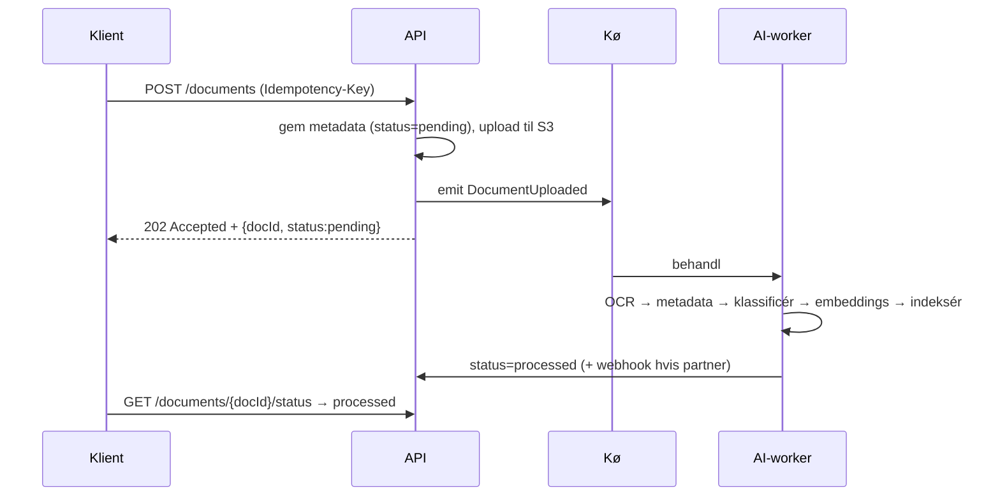
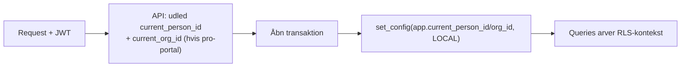

# House Passport — Trin 6–8
## Database-design · API-design · Multi-tenant strategi

> Leverance 3 af 17. Bygget oven på domænemodellen fra Trin 4–5 (Bolig som varig rod + AccessGrant).
> Konkret nok til at et team kan begynde at implementere skema og API-kontrakt.

---

## 0. Den bærende indsigt for hele dette trin

Skemaet har **to fundamentalt forskellige adgangsmønstre**, og de må ikke blandes sammen:

| Datatype | Eksempel | Adgangsmønster | RLS-strategi |
|---|---|---|---|
| **Org-ejet data** | org-medlemmer, abonnement, org-indstillinger | Klassisk tenant-isolation | `org_id = current_org` |
| **Boligdata (delt commons)** | bolig, dokumenter, servicehistorik | Ejer-kontrolleret, tilgået via grants | EXISTS(ejerskab) OR EXISTS(grant) |

Boligen er **ikke** tenant-ejet. En bank "har" aldrig en bolig i sin tenant — den får en grant. Derfor kan RLS for boligdata ikke være en simpel `tenant_id`-sammenligning; den skal evaluere ejerskab og grants. Det er den vigtigste — og mest oversete — beslutning i hele datalaget.

---

# TRIN 6 — DATABASE-DESIGN

## 6.1 Principper

- PostgreSQL som primær kilde til sandhed; RLS som sidste forsvarslinje (ikke kun applikationslag).
- Boligen er rod; intet dokument hænger direkte på en bruger.
- Store tabeller (dokumenter, audit) partitioneres fra start.
- Embeddings adskilt fra dokument-metadata (lean kernetabel).
- GDPR-sletning forenes med uforanderlig audit via **crypto-shredding**.

## 6.2 Kerneskema (udvalgt DDL)

```sql
-- ORGANISATIONER (tenants)
CREATE TABLE organization (
  id          uuid PRIMARY KEY DEFAULT gen_random_uuid(),
  type        text NOT NULL CHECK (type IN
              ('maegler','bank','forsikring','haandvaerker','administrator')),
  name        text NOT NULL,
  branding    jsonb NOT NULL DEFAULT '{}',     -- white-label (alliance-vejen)
  is_isolated boolean NOT NULL DEFAULT false,   -- promote-to-isolated flag
  created_at  timestamptz NOT NULL DEFAULT now()
);

-- PERSONER
CREATE TABLE person (
  id                uuid PRIMARY KEY DEFAULT gen_random_uuid(),
  display_name      text,
  is_mitid_verified boolean NOT NULL DEFAULT false,
  created_at        timestamptz NOT NULL DEFAULT now()
);

-- ORG-MEDLEMSKAB (person ↔ org + rolle)
CREATE TABLE org_membership (
  id        uuid PRIMARY KEY DEFAULT gen_random_uuid(),
  org_id    uuid NOT NULL REFERENCES organization(id) ON DELETE CASCADE,
  person_id uuid NOT NULL REFERENCES person(id) ON DELETE CASCADE,
  role      text NOT NULL,                      -- RBAC-rolle (Trin 9 detaljerer)
  UNIQUE (org_id, person_id)
);

-- BOLIG (den varige rod — IKKE tenant-ejet)
CREATE TABLE property (
  id            uuid PRIMARY KEY DEFAULT gen_random_uuid(),
  bfe_number    text UNIQUE NOT NULL,           -- varig national ejendomsnøgle
  address       text NOT NULL,
  bbr_snapshot  jsonb,
  energy_label  text,
  property_type text,
  build_year    int,
  created_at    timestamptz NOT NULL DEFAULT now()
);

-- EJERSKABSPERIODE (tidsrelation oven på boligen)
CREATE TABLE ownership_period (
  id             uuid PRIMARY KEY DEFAULT gen_random_uuid(),
  property_id    uuid NOT NULL REFERENCES property(id),
  person_id      uuid NOT NULL REFERENCES person(id),
  valid_from     date NOT NULL,
  valid_to       date,                          -- NULL = nuværende ejer
  mitid_verified boolean NOT NULL DEFAULT false
);
-- INVARIANT: højst én aktiv ejer pr. bolig (håndhævet i databasen)
CREATE UNIQUE INDEX one_active_owner
  ON ownership_period (property_id) WHERE valid_to IS NULL;

-- ACCESS GRANT (hjertet i al deling)
CREATE TABLE access_grant (
  id           uuid PRIMARY KEY DEFAULT gen_random_uuid(),
  property_id  uuid NOT NULL REFERENCES property(id),
  subject_type text NOT NULL CHECK (subject_type IN ('person','organization')),
  subject_id   uuid NOT NULL,                   -- person.id ELLER organization.id
  scope        text[] NOT NULL,                 -- fx '{documents:read,maintenance:read}'
  permission   text NOT NULL CHECK (permission IN ('read','write','admin')),
  valid_from   timestamptz NOT NULL DEFAULT now(),
  valid_to     timestamptz,                     -- NULL = ubegrænset
  granted_by   uuid NOT NULL REFERENCES person(id),
  consent_id   uuid,                            -- → consent_record (GDPR)
  created_at   timestamptz NOT NULL DEFAULT now()
);
CREATE INDEX grant_by_subject  ON access_grant (subject_type, subject_id, property_id);
CREATE INDEX grant_by_property ON access_grant (property_id);

-- DOKUMENT (partitioneret på property_id-hash → en boligs docs co-lokeres)
CREATE TABLE document (
  id                 uuid DEFAULT gen_random_uuid(),
  property_id        uuid NOT NULL,
  category           text,
  source             text CHECK (source IN ('manual','email','craftsman','registry')),
  is_transferable    boolean NOT NULL DEFAULT true,   -- følger boligen ved salg?
  ai_metadata        jsonb,
  s3_key             text NOT NULL,
  encryption_key_ref text NOT NULL,               -- crypto-shredding-nøgle
  processing_status  text NOT NULL DEFAULT 'pending',
  created_at         timestamptz NOT NULL DEFAULT now(),
  PRIMARY KEY (id, property_id)
) PARTITION BY HASH (property_id);
-- Opret fx 32 hash-partitioner ved seed.

-- EMBEDDINGS (adskilt fra metadata; samme property_id så RLS gælder)
CREATE EXTENSION IF NOT EXISTS vector;
CREATE TABLE document_chunk (
  id          uuid PRIMARY KEY DEFAULT gen_random_uuid(),
  document_id uuid NOT NULL,
  property_id uuid NOT NULL,                     -- bæres med, så grant-RLS gælder AI-søgning
  chunk_text  text,
  embedding   vector(1536)
);
CREATE INDEX ON document_chunk USING hnsw (embedding vector_cosine_ops);

-- AUDIT (append-only, partitioneret på tid, tamper-evidence)
CREATE TABLE audit_event (
  id          uuid DEFAULT gen_random_uuid(),
  occurred_at timestamptz NOT NULL DEFAULT now(),
  actor_person_id uuid,
  actor_org_id    uuid,
  property_id     uuid,
  action      text NOT NULL,
  target_type text,
  target_id   uuid,
  prev_hash   text,                              -- hash-kæde for tamper-evidence
  PRIMARY KEY (id, occurred_at)
) PARTITION BY RANGE (occurred_at);
```

## 6.3 RLS-policies (de to mønstre, konkret)

```sql
-- MØNSTER 1: org-ejet data → klassisk tenant-isolation
ALTER TABLE org_membership ENABLE ROW LEVEL SECURITY;
CREATE POLICY org_isolation ON org_membership
  USING (org_id = current_setting('app.current_org_id', true)::uuid);

-- MØNSTER 2: boligdata → ejerskab ELLER gyldig grant
ALTER TABLE document ENABLE ROW LEVEL SECURITY;
CREATE POLICY document_access ON document
  USING (
    EXISTS (  -- nuværende ejer
      SELECT 1 FROM ownership_period op
      WHERE op.property_id = document.property_id
        AND op.person_id   = current_setting('app.current_person_id', true)::uuid
        AND op.valid_to IS NULL
    )
    OR EXISTS (  -- person-grant (ægtefælle, barn ...)
      SELECT 1 FROM access_grant g
      WHERE g.property_id = document.property_id
        AND g.subject_type = 'person'
        AND g.subject_id   = current_setting('app.current_person_id', true)::uuid
        AND (g.valid_to IS NULL OR g.valid_to > now())
        AND 'documents:read' = ANY (g.scope)
    )
    OR EXISTS (  -- org-grant (mægler/bank handler på vegne af org)
      SELECT 1 FROM access_grant g
      WHERE g.property_id = document.property_id
        AND g.subject_type = 'organization'
        AND g.subject_id   = current_setting('app.current_org_id', true)::uuid
        AND (g.valid_to IS NULL OR g.valid_to > now())
        AND 'documents:read' = ANY (g.scope)
    )
  );
```

Samme grant-baserede policy gælder `document_chunk` (derfor bærer den `property_id`) — ellers ville AI-søgningen kunne lække på tværs af boliger. **Dette er en kritisk regel:** enhver tabel med boligdata skal bære `property_id` og bruge mønster 2.

## 6.4 Partitionering

- **`document`**: HASH på `property_id` (~32 partitioner). Dominant query er "alle dokumenter for én bolig" → co-lokeret, hurtig. Skalerer rent forbi 10 mio. rækker.
- **`audit_event`**: RANGE på `occurred_at` (månedlig). Append-tungt, tidsforespurgt, gammel historik kan flyttes til billig lagring/arkiv.

## 6.5 Audit & tamper-evidence

`audit_event` er **append-only**: applikationsrollen får `INSERT`, ikke `UPDATE`/`DELETE`. Hver post bærer `prev_hash` (hash af forrige post i samme partition/stream) → en hash-kæde, der gør manipulation opdagelig. For enterprise-kunder kan kæde-rødder periodisk forankres i et eksternt write-once-lager (WORM/S3 Object Lock).

## 6.6 GDPR: sletning vs. uforanderlighed (crypto-shredding)

Spændingen: retten til sletning vs. kravet om uforanderlig audit. Løsning:

- Dokumentindhold i S3 krypteres pr. dokument; nøglen ligger i KMS (`encryption_key_ref`).
- **Sletning = destruér nøglen** ("crypto-shredding") → S3-objektet bliver permanent ulæseligt uden at vi skal jagte hver kopi/backup.
- Persondata-rækker anonymiseres/slettes; **auditfakta bevares** (hvem tilgik hvad og hvornår) med lovligt grundlag, men uden det følsomme indhold.

## 6.7 Prisma + RLS — faldgruben løst (jf. Trin 4)

Prisma sætter ikke automatisk tenant-kontekst. RLS læser session-variable, og en transaction-mode connection pooler (PgBouncer) deler forbindelser, så en `SET` kan "lække" til næste forespørgsel. Korrekt mønster: sæt konteksten **lokalt i samme transaktion** som forespørgslen:

```ts
// Per-request: kør al data-adgang i én interaktiv transaktion
await prisma.$transaction(async (tx) => {
  await tx.$executeRaw`SELECT set_config('app.current_person_id', ${personId}, true)`;
  await tx.$executeRaw`SELECT set_config('app.current_org_id',    ${orgId ?? ''}, true)`;
  // ... alle queries her arver tenant-konteksten via RLS
});
```

`set_config(..., true)` = transaction-lokal, så den nulstilles automatisk og lækker ikke gennem pooleren. Tenant-isolation skal have **automatiserede negative tests i CI** (forsøg på cross-tenant-læsning skal fejle).

---

# TRIN 7 — API-DESIGN

## 7.1 Principper

- **OpenAPI-kontrakt først.** Kontrakten er sandheden; klienter og servere genereres/valideres mod den.
- **Ressource-orienteret REST**, versioneret via URL-præfiks (`/v1`). GraphQL-gateway kan lægges ovenpå senere.
- **Ingen forretningslogik i klienten.** Autorisation håndhæves serverside + RLS.
- **Async hvor arbejdet er tungt** (dokumentbehandling), med status-polling/webhooks.

## 7.2 Ressourcekort (udvalg)

| Ressource | Centrale endpoints |
|---|---|
| Properties | `GET/POST /v1/properties`, `GET /v1/properties/{id}`, `POST /v1/properties/{id}/refresh-registry` |
| Documents | `POST /v1/properties/{id}/documents` (upload), `GET .../documents`, `GET .../documents/{docId}`, `GET .../documents/{docId}/status` |
| Service records | `POST/GET /v1/properties/{id}/service-records` |
| Warranties | `GET /v1/properties/{id}/warranties` |
| Maintenance | `GET /v1/properties/{id}/maintenance-plan`, `POST .../tasks`, `POST .../tasks/{id}/complete` |
| Access grants | `POST /v1/properties/{id}/grants`, `DELETE .../grants/{grantId}` |
| Ownership | `POST /v1/properties/{id}/transfer` (ejerskifte) |
| Organizations | `GET/POST /v1/organizations`, `.../members`, `.../branding` |
| AI assistant | `POST /v1/properties/{id}/assistant/query` |
| Subscriptions | `GET/POST /v1/organizations/{id}/subscription` |

## 7.3 Konventioner

- **Pagination:** cursor-baseret (`?cursor=&limit=`), aldrig offset på store tabeller.
- **Fejlmodel:** RFC 7807 `application/problem+json` (`type`, `title`, `status`, `detail`, `traceId`).
- **Idempotens:** `Idempotency-Key`-header på alle skrivende kald (kritisk ved upload-retries).
- **Filtrering/sortering:** eksplicit whitelistede felter.
- **Concurrency:** `ETag` + `If-Match` på opdateringer.

## 7.4 Async dokument-flow



## 7.5 Partner-/håndværker-integrationskontrakt (alliance-vejen)

Fordi vi holder alliance-vejen åben (Trin 1–3-valg), eksponeres håndværker-/partner-dataindtag som en **åben, standardiseret kontrakt** — ikke en lukket egen-flow:

- **Indgående:** `POST /v1/integrations/service-records` med partner-API-nøgle (OAuth2 client-credentials), så en håndværker-/branchepartners eget system kan pushe udført arbejde + garanti + dokument til den rette bolig (matchet på BFE-nummer).
- **Udgående webhooks:** partnere abonnerer på events (`document.processed`, `warranty.expiring`, `ownership.transferred`) med signerede payloads (HMAC) + retry.
- Det betyder, at *enten* vi onboarder håndværkere direkte, *eller* en alliancepartners eksisterende håndværkerbase kan tilføre data — uden kerneændringer.

## 7.6 Eksempel-endpoint (OpenAPI-uddrag)

```yaml
paths:
  /v1/properties/{propertyId}/documents:
    post:
      summary: Upload dokument til en bolig (async behandling)
      parameters:
        - name: propertyId
          in: path
          required: true
          schema: { type: string, format: uuid }
        - name: Idempotency-Key
          in: header
          required: true
          schema: { type: string }
      requestBody:
        content:
          multipart/form-data:
            schema:
              type: object
              properties:
                file: { type: string, format: binary }
                category: { type: string }
                isTransferable: { type: boolean }
      responses:
        "202":
          description: Accepteret til behandling
          content:
            application/json:
              schema:
                type: object
                properties:
                  documentId: { type: string, format: uuid }
                  status: { type: string, enum: [pending] }
        "403": { description: Ingen gyldig adgang til boligen }
```

## 7.7 Rate limiting

Pr. tenant og pr. nøgle (token-bucket i Redis). Adskilte budgetter for interaktiv brug vs. bulk-/partner-import, så en mæglers masseimport ikke udsulter forbrugertrafik.

---

# TRIN 8 — MULTI-TENANT STRATEGI (DETALJERET)

## 8.1 Tenant-taksonomi

- **Personlig kontekst** (husstand om en bolig): *ikke* en klassisk tenant. Adgang = ejerskab + grants på boligen.
- **Organisations-tenant** (mægler/bank/forsikring/håndværker/administrator): klassisk tenant med medlemmer, roller, branding, abonnement.

## 8.2 Isolationsmodel

**Pooled + RLS** for alle (1 mio.+ personlige kontekster, tusinder af org-tenants). **Promote-to-isolated** escape-hatch: en stor enterprise-tenant (fx en bank med skærpede krav) kan flyttes til en dedikeret database/skema — `organization.is_isolated=true` router forbindelsen — uden domæneændringer. Det er prisen for at holde *både* venture- og alliance-vejen åben, betalt kun når en kunde kræver det.

## 8.3 Tenant-kontekst-propagering



Konteksten udledes serverside fra et betroet token — aldrig fra klient-input. Et kompromitteret klientforsøg på at angive en anden tenant ignoreres.

## 8.4 De to RLS-mønstre (reference)

Implementeret i §6.3: mønster 1 (`org_id = current_org`) for org-ejet data; mønster 2 (ejerskab OR grant) for boligdata. **Regel:** hver ny tabel klassificeres som org-ejet eller boligdata, før den oprettes — det afgør hvilket mønster og hvilke kolonner (`org_id` vs. `property_id`) den skal bære.

## 8.5 Tenant-livscyklus

Provisionering (selvbetjent for håndværker/mægler; aftalt onboarding for bank/forsikring) → konfiguration (roller, branding, integrationsnøgler) → aktiv → suspendering → **offboarding med dataeksport + sletning**. Hver fase er audit-logget.

## 8.6 White-label / branding (alliance-vejen)

`organization.branding` (logo, farver, domæne) gør det muligt at køre portaler under en partners brand. Holder alliance-scenariet åbent uden kodeforgrening: samme kerne, tenant-bestemt udseende.

## 8.7 Noisy-neighbor & fairness

Pr.-tenant rate limits (§7.7); separate kø-budgetter for bulk-import; query-timeouts; overvågning af tenant-ressourceforbrug i Datadog → store forbrugere er kandidater til isolation (§8.2).

## 8.8 Per-tenant GDPR

- **Dataeksport** pr. tenant og pr. bolig (maskinlæsbart) — også et salgsargument over for enterprise.
- **Sletning** via crypto-shredding (§6.6); auditfakta bevares.
- **Residency:** al lagring i EU (AWS eu-regioner) fra dag ét.
- Boligdata slettes ikke, blot fordi én org-grant tilbagekaldes — boligen og dens iboende historik tilhører boligen/ejeren, ikke organisationen.

## 8.9 Risici

1. **Grant-baseret RLS-performance** ved mange grants/dokumenter → indekser på `access_grant` (§6.2) + EXISTS-subqueries; overvåg; overvej en vedligeholdt effektiv-adgangstabel, hvis profilering kræver det.
2. **Forkert tabel-klassificering** (boligdata uden `property_id`) → lækage. Modvirkes af §8.4-reglen + CI-isolationstests.
3. **Isolation-escape-hatch-drift:** isolerede tenants må ikke divergere i skema → samme migrationer kører overalt; isolation er fysisk, ikke logisk afvigelse.

---

## Næste leverance

**Trin 9 — Sikkerheds- & GDPR-arkitektur:** komplet RBAC-rollemodel (de privat/professionel/system-roller fra briefet), MitID-broker-flow og samtykkestyring, krypteringsstrategi (at-rest/in-transit/crypto-shredding), session-/token-håndtering, audit-omfang, rate limiting, security monitoring og penetrationstest-strategi — den fulde "enterprise-grade sikkerhed", briefet kræver.
