# House Passport — Trin 9
## Sikkerheds- & GDPR-arkitektur

> Leverance 4 af 17. Den fulde "enterprise-grade sikkerhed", briefet kræver — bygget på trusselsmodel, ikke en tjekliste.
> Forudsætter Bolig-som-rod (Trin 5), grant-baseret RLS (Trin 6/8) og crypto-shredding (Trin 6).

---

## 0. Trusselsmodel (hvad forsvarer vi os mod?)

Sikkerhed uden en trusselsmodel er bare en indkøbsliste. De reelle trusler mod House Passport, rangordnet efter konsekvens:

| # | Trussel | Hvorfor kritisk | Primært forsvar |
|---|---|---|---|
| 1 | **Cross-tenant/bolig-lækage** | Én boligs data set af forkert part = total tillidskollaps | Grant-baseret RLS (§Trin 6.3) + CI-isolationstests |
| 2 | **Falsk ejerskabspåstand** | Nogen "overtager" en bolig de ikke ejer → kan dele/sælge andres data | MitID-ejerverificering mod autoritativt register (§2) |
| 3 | **Partner/insider-overadgang** | En mægler/bank tilgår boliger ud over sin grant | Grant-scope + step-up + anomalidetektion (§9) |
| 4 | **Dokument-eksfiltrering** | Følsomme økonomi-/forsikringsdokumenter | Kryptering + crypto-shredding + adgangs-audit (§4, §6) |
| 5 | **AI prompt-injektion via uploadet dokument** | Et ondsindet dokument "instruerer" assistenten | Dokumentindhold = utroet; assistent bundet til RLS-scope (§8) |
| 6 | **Account takeover** | Adgang til boligejers fulde profil | Step-up auth, session-styring, anomalidetektion (§5, §9) |
| 7 | **Forsyningskæde/afhængigheder** | Kompromitteret pakke i build | SCA, SAST, secret-scanning i CI (§10) |
| 8 | **DDoS/abuse** | Nedetid, omkostnings-spike | WAF, rate limiting, autoscaling (§9) |

De to øverste er produktdefinerende: hvis vi fejler på dem, er platformen værdiløs — og uigenkaldeligt, fordi tillid ikke kan genvindes.

---

## 1. RBAC — to lag, der altid komponeres

**Den bærende regel:**
> Adgang til en bolig kommer **aldrig** fra en rolle alene. En rolle giver *evnen til at handle*. Ejerskab eller en grant giver *adgang til en konkret bolig*. **Begge kræves.**

Det forhindrer "en mægler kan se alle boliger". En mægler kan se *de* boliger, hvor en ejer har givet hans organisation en grant — intet andet.

### 1.1 Tilladelses-primitiver (eksempler)

`property:read` · `property:write` · `document:read` · `document:write` · `document:delete` · `grant:create` · `grant:revoke` · `ownership:transfer` · `org:manage` · `member:manage` · `billing:manage`

### 1.2 De private "roller" = grant-arketyper på en bolig

Briefets private roller er ikke org-roller — de er foruddefinerede grant-skabeloner (scope + permission) på en konkret bolig:

| Rolle | Kilde | Rettigheder |
|---|---|---|
| **Boligejer** | `ownership_period` (ikke en grant) | Fuld admin på egen bolig; eneste der kan overdrage/slette/uddele bred adgang |
| **Medejer** | `ownership_period` (flere personer) | Som ejer |
| **Samlever** | Grant (bred read/write) | Alt undtagen ejerskifte og tilbagekaldelse af ejer |
| **Barn (mindreårig)** | Grant (begrænset read) | Aldersafpasset, **ingen** følsomme økonomi-/forsikringskategorier, ingen deling |
| **Gæst** | Grant (snæver, tidsbegrænset) | Læseadgang til udvalgte moduler/dokumenter |

> **Mindreårige:** En "barn"-konto får begrænset, læse-domineret adgang og eksponeres aldrig for følsomme finansielle/forsikringsmæssige dokumenter. Oprettelse og adgang for mindreårige håndteres med forælder-/ejer-samtykke.

### 1.3 De professionelle roller = org-RBAC + modtaget grant

| Org-rolle (i tenant) | Org-evne | Typisk grant modtaget på en bolig |
|---|---|---|
| **Ejendomsmægler** | Handle på vegne af mæglertenant | Tidsbegrænset read + dokumentindhentning under salgsperiode |
| **Forsikringsrådgiver** | Handle på vegne af forsikringstenant | Snæver read på relevante docs + vedhæft skadesdokumentation |
| **Bankrådgiver** | Handle på vegne af banktenant | Snæver read på energi-/vurderings-/pantrelevante data |
| **Håndværker** | Handle på vegne af håndværkertenant | Skrive-grant (upload servicerapport/garanti), ofte bundet til jobbet |
| **Administrator (Tenant Admin)** | Styrer org'ens medlemmer, roller, branding, billing | **Ingen** automatisk boligadgang — kræver stadig grant |

### 1.4 Systemroller (platform)

| Rolle | Princip |
|---|---|
| **Support** | Mindst muligt; tidsbegrænset; ser ikke dokumentindhold uden eksplicit brugersamtykke eller break-glass; alt audit-logget |
| **Tenant Admin (platform)** | Administrerer en tenant; ingen tavs boligadgang |
| **Super Admin** | Break-glass kun; hver handling audit-logget og notificerer berørt ejer; ingen tavs adgang til kundedokumenter |

---

## 2. Identitet, MitID & ejerverificering (tillidens omdrejningspunkt)

**Kritisk skelnen:** at *logge ind* (autentificering) er ikke det samme som at *bevise ejerskab* (verificering). House Passport adskiller dem eksplicit.

```mermaid
sequenceDiagram
    participant U as Bruger
    participant HP as House Passport
    participant B as MitID-broker (certificeret)
    participant R as Autoritativt ejerregister (Datafordeleren/tinglysning)
    U->>HP: Tilføj bolig (BFE-nummer)
    HP->>HP: Opret UVERIFICERET ejerskab (kan ikke sælges/deles som verificeret)
    U->>HP: Verificér ejerskab
    HP->>B: Start MitID-login
    B-->>HP: Verificeret identitet
    HP->>R: Matcher identitet mod registreret ejer af BFE
    R-->>HP: Match / intet match
    HP->>HP: Sæt ownership_period.mitid_verified = true (ved match)
```

- **MitID via certificeret broker** — vi bygger aldrig egen IdP; vi fødererer.
- **Falsk-ejerskab afværges:** før verificering er en bolig *selvhævdet og uverificeret* — den kan ikke overdrages eller deles som verificeret data. Man kan altså ikke "kapre" naboens bolig.
- **Verificeret-flaget er det, der gør dataene B2B-værdifulde** (banker/forsikringer betaler for *verificerede* data) og som låser op for ejerskifte-flowet.
- **Step-up auth** kræves ved følsomme handlinger: ejerskifte, uddeling af bred adgang, sletning.

---

## 3. Samtykkestyring (GDPR-fundament)

- **Samtykke er en førsteklasses entitet** (`consent_record`), knyttet til hver grant og til MitID-afledte data: tidsstemplet, versioneret (samtykketekstens version), granulært og **altid tilbagekaldeligt**.
- **Retsgrundlag (Art. 6) kortlagt pr. behandling:** aftale (selve tjenesten), retlig forpligtelse, legitim interesse (audit/svindelbekæmpelse), samtykke (deling med tredjepart).
- **Tilbagekaldelse** af samtykke → tilbagekalder den tilhørende grant; auditfakta bevares.
- **Gennemsigtighed:** ejeren kan altid se, hvem der har/havde adgang til hans bolig (også et tillidsprodukt, ikke kun compliance).

---

## 4. Kryptering

| Lag | Tiltag |
|---|---|
| **In transit** | TLS 1.3 overalt; HSTS; mTLS for intern service-til-service og partner-trafik |
| **At rest (dokumenter)** | S3 SSE-KMS med **envelope-kryptering pr. dokument** → muliggør crypto-shredding (Trin 6.6) |
| **At rest (database)** | Krypteret storage; krypterede, point-in-time-backups |
| **Nøglestyring** | AWS KMS; rotation; adskillelse af pligter; applikationen ser aldrig master-nøgler |
| **Secrets** | Secrets Manager; ingen hemmeligheder i kode/repo; scannet i CI |
| **Felt-niveau (valgfrit)** | Ekstra felt-kryptering på de mest følsomme PII-felter |

Elegant bivirkning: fordi sletning er nøgledestruktion, gør crypto-shredding også **backup-kopier** ulæselige — vi behøver ikke jagte hver backup ved en sletteanmodning.

---

## 5. Session- & token-håndtering

- **Kortlevende access-tokens** (JWT) + refresh-tokens med rotation og tilbagekaldelsesliste.
- Token bærer tenant-/aktør-claims, der bliver til RLS-konteksten (Trin 8.3) — udledt serverside, aldrig fra klient.
- **Session-styring for brugeren:** se aktive enheder/sessioner, tilbagekald enkeltvis.
- **Step-up/re-auth** ved følsomme handlinger.
- **Partner-API:** OAuth2 client-credentials, snævert scoped, roterende nøgler, valgfri IP-allowlist.

---

## 6. Audit, versionering & gennemsigtighed

- **Append-only audit** (Trin 6.5). Omfang: enhver adgang til en bolig/dokument, hver grant-ændring, hvert ejerskifte, hver admin-/break-glass-handling, hver eksport/sletning.
- **Dokumentversionshistorik:** uforanderlige versioner; intet overskrives stille.
- **Adgangsgennemsigtighed:** "hvem har set min bolig" eksponeres for ejeren.

---

## 7. Backup & disaster recovery

- **Mål:** RPO ≤ 15 min (PITR), RTO ≤ 4 timer (skærpes for enterprise-tenants).
- PostgreSQL point-in-time-recovery; **krydsregions** krypterede backups (i EU); S3-versionering + replikering.
- **Regelmæssige restore-øvelser** (en backup, der aldrig er testet, er ikke en backup).
- Backups respekterer crypto-shredding automatisk (§4).

---

## 8. AI-specifik sikkerhed (ofte glemt — kritisk her)

Med tung AI-komponent og brugeruploadet indhold er det her et selvstændigt angrebsflade:

- **Prompt-injektion:** indholdet i et uploadet dokument behandles som **utroet input**. Assistenten kan ikke udstede værktøjskald eller forespørgsler på tværs af boliger pga. et dokuments instruktioner — den opererer strengt inden for den aktuelle aktørs RLS-scope.
- **Retrieval gennem samme adgangskontrol:** assistentens søgning går gennem den grant-baserede RLS (derfor bærer `document_chunk` `property_id`) → den kan kun hente data, aktøren selv må se.
- **Databehandleraftale (DPA) med AI-udbyder; ingen træning på kundedata** (eller eksplicit, granulært samtykke); EU-databehandling tilstræbt.
- **PII-minimering i prompts**; output-filtrering.

---

## 9. Security monitoring & detektion

- Centraliseret logning; sikkerhedshændelser adskilt fra applikationslogs.
- **Anomalidetektion:** usædvanlige adgangsmønstre alarmeres — fx en mægler, der pludselig tilgår 1.000 boliger, eller masse-eksport. Det er det primære forsvar mod insider/partner-misbrug.
- Sentry (fejl) + Datadog (metrics/traces/sikkerhedssignaler).
- Edge: WAF, bot-beskyttelse, rate limiting (Trin 7.7).

---

## 10. Penetrationstest- & secure-SDLC-strategi

- **Før launch:** ekstern penetrationstest. Derefter årligt + ved større ændringer.
- **Kontinuerligt i CI:** SAST, DAST, dependency-scanning (SCA), secret-scanning, container-scanning.
- **CI-isolationstests** (cross-tenant-læsning skal fejle) er en hård sikkerhedsgate (jf. Trin 6/8).
- **Trusselsmodellering pr. større feature** (genbrug skabelonen i §0).
- **Bug bounty** når produktet er modent.

---

## 11. Compliance-position & -roadmap

- **GDPR-kerne:** retsgrundlag pr. behandling, DPA'er med underdatabehandlere, fortegnelse over behandlingsaktiviteter (ROPA), og en **DPIA** — sandsynligvis påkrævet pga. skala, MitID-data og profilering (vedligeholdelsesanbefalinger). Lav DPIA tidligt.
- **DPO:** vurdér behov; sandsynligt ved skala og datatyper.
- **Enterprise-salg kræver mere end GDPR:** banker og forsikringer køber sjældent uden **ISO 27001 / SOC 2**. Sekventér: GDPR + grundsikkerhed → ISO 27001-forberedelse → certificering, i takt med enterprise-pipeline. Manglende certificering er en konkret salgsblokering, ikke en teknisk detalje.
- **NIS2:** kan blive relevant, hvis vi leverer til banker/kritisk infrastruktur — flag tidligt.

---

## 12. De hårdeste problemer (ærlig opsummering)

1. **Ejerverificering** er hele tillidsfundamentet. Få den rigtig, ellers er intet andet værd at bygge.
2. **Partner/insider-overadgang** kræver både teknisk scope *og* adfærdsdetektion — teknik alene fanger det ikke.
3. **AI prompt-injektion** er en ny klasse af angreb, som de fleste teams undervurderer; vores forsvar er at binde assistenten til RLS-scope og behandle alt dokumentindhold som utroet.
4. **Enterprise-compliancebar (ISO/SOC2)** er en forretningsblokering forklædt som teknik — planlæg den ind i roadmap fra start (Trin 14).

---

## Næste leverance

**Trin 10–13 — Designspor:** wireframes (centrale flows: onboarding, dashboard, dokumentcenter, deling, salgsklargøring), UI-designsystem (farver/typografi/spacing efter briefets premium-filosofi: Linear/Stripe/Notion-niveau), komponentbibliotek (shadcn-baseret) og brugerrejser for både boligejer og de professionelle roller.
