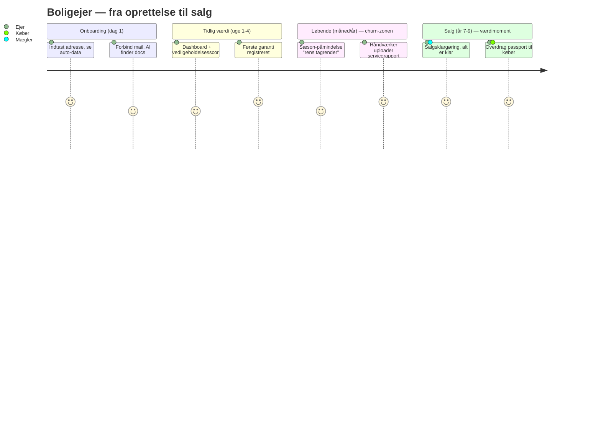

# House Passport — Trin 10–13
## Wireframes · UI-designsystem · Komponentbibliotek · Brugerrejser

> Leverance 5 af 17. Designspecifikationer — ikke bygget kode (det er Trin 18).
> Leveret som konkrete, copy-paste-klare tokens og layouts, så et team kan implementere 1:1.
> Designfilosofi fra briefet: premium, minimalistisk, Linear/Stripe/Notion/Apple-niveau. Ingen emoji, ingen visuel støj.

---

# TRIN 10 — WIREFRAMES (kerneflows)

Lav-fidelity strukturskitser. Fokus på informationshierarki og flow, ikke pixels.

## 10.1 Onboarding (revideret løfte: "i gang på 5 min", jf. Trin 1.3)

```
┌─────────────────────────────────────────────┐
│  House Passport                               │
│                                               │
│   Trin 1 af 4 ·  ●───○───○───○                │
│                                               │
│   Hvad er din adresse?                        │
│   ┌─────────────────────────────────────┐     │
│   │ Søg adresse...                  🔍  │     │
│   └─────────────────────────────────────┘     │
│   (auto-complete fra DAR/adresseregister)     │
│                                               │
│              [ Fortsæt → ]                     │
└─────────────────────────────────────────────┘
        ↓ (auto-hent BBR, energimærke, vurdering)
┌─────────────────────────────────────────────┐
│   Vi fandt din bolig                          │
│   ┌───────────┐  Æblevej 12, 8000 Aarhus      │
│   │  [foto]   │  Parcelhus · 142 m² · 1974     │
│   └───────────┘  Energimærke: C               │
│                                               │
│   Dokumentationsgrad: ▓▓░░░░░░ 18%            │
│   "Forbind din mail, så finder vi resten."    │
│                                               │
│   [ Forbind Gmail/Outlook ]  [ Spring over ]  │
└─────────────────────────────────────────────┘
```
*Designintention:* den auto-hentede data giver "wow" med det samme; **dokumentationsgraden** gør tomheden til en motiverende fremdriftsindikator i stedet for et tomt dashboard.

## 10.2 Dashboard

```
┌──────────────────────────────────────────────────────────┐
│ ☰  Æblevej 12          [ Søg ]        🔔   ◐  Sema ▼      │
├──────────────────────────────────────────────────────────┤
│ ┌────────────────────────┐  ┌──────────────────────────┐ │
│ │ [boligfoto]            │  │ Vedligeholdelsesscore    │ │
│ │ Æblevej 12, Aarhus     │  │        ◔  72/100         │ │
│ │ Parcelhus · 142 m²     │  │ "God stand · 2 opgaver"  │ │
│ │ Vurdering 3,2 mio.     │  └──────────────────────────┘ │
│ │ Energimærke C          │                               │
│ └────────────────────────┘                               │
│                                                          │
│  HURTIG STATUS                                           │
│  ┌──────────┐ ┌──────────┐ ┌──────────┐ ┌────────────┐  │
│  │ 2 opgaver│ │ 3 aktive │ │ 5 mangl. │ │ 1 udløber  │  │
│  │ kommende │ │ garantier│ │ dokum.   │ │ serviceaft.│  │
│  └──────────┘ └──────────┘ └──────────┘ └────────────┘  │
│                                                          │
│  SENESTE AKTIVITET                                       │
│  • Tagrapport uploadet (AI: kategori "Tag")    2 t siden │
│  • Garanti registreret: varmepumpe (5 år)      i går     │
│  • Anbefaling: tagrender bør renses til efterår          │
└──────────────────────────────────────────────────────────┘
```

## 10.3 Dokumentcenter

```
┌──────────────────────────────────────────────────────────┐
│  Dokumenter            [ + Upload ]     [ Søg dokumenter ]│
├───────────────┬──────────────────────────────────────────┤
│ KATEGORIER    │  El · VVS · Tag · Vinduer · ... (filtre) │
│ □ El      (4) │  ┌────────────────────────────────────┐  │
│ □ VVS     (2) │  │ 📄 Elinstallationsrapport_2023.pdf │  │
│ ▣ Tag     (3) │  │    Tag · Garanti til 2028 · Verif. │  │
│ □ Garanti (5) │  ├────────────────────────────────────┤  │
│ □ Forsikr.(1) │  │ 📄 Tagrapport_HCTag.pdf            │  │
│ ...           │  │    Tag · Udført af HC Tag ApS      │  │
│               │  ├────────────────────────────────────┤  │
│ [ AI-assist ] │  │ 📄 Foto_tagrygning.jpg            │  │
│               │  └────────────────────────────────────┘  │
└───────────────┴──────────────────────────────────────────┘
```
*(AI-foreslået kategori + metadata vises pr. dokument; ejeren kan rette.)*

## 10.4 Dokument-detalje (med transferabilitet)

```
┌──────────────────────────────────────────────────────────┐
│ ← Tilbage     Tagrapport_HCTag.pdf            [ ⋯ Menu ] │
├────────────────────────────────┬─────────────────────────┤
│                                │  METADATA (AI-udtrukket) │
│        [ PDF-preview ]         │  Kategori:   Tag         │
│                                │  Udført af:  HC Tag ApS  │
│                                │  Dato:       14.05.2023  │
│                                │  Garanti:    til 2033    │
│                                │  ───────────────────────│
│                                │  Følger boligen ved salg │
│                                │   [●  Ja, bolig-iboende ]│
│                                │  Versioner (2) ▾         │
└────────────────────────────────┴─────────────────────────┘
```
*Transferabilitets-toggle (Trin 5.5) er synligt og redigerbart — produkt- og GDPR-krav i ét.*

## 10.5 Deling / grant

```
┌──────────────────────────────────────────────────────────┐
│  Del adgang til boligen                          [ ✕ ]   │
│                                                          │
│  Hvem?    ┌────────────────────────────────────┐         │
│           │ e-mail eller virksomhed...        │         │
│           └────────────────────────────────────┘         │
│  Som:     ( ) Samlever  ( ) Gæst  ( ) Håndværker         │
│           ( ) Mægler    ( ) Bank/forsikring              │
│  Adgang:  ▣ Dokumenter  □ Vedligehold  □ Økonomi         │
│  Periode: [ Indtil videre ▾ ]                            │
│                                                          │
│  ⓘ Modtageren skal acceptere · alt logges · kan altid    │
│    tilbagekaldes                                         │
│              [ Annullér ]   [ Giv adgang ]               │
└──────────────────────────────────────────────────────────┘
```
*Én UI for al deling → afspejler den ene `AccessGrant`-mekanik (Trin 5.3).*

## 10.6 Mægler-portal (salgsklargøring — én pro-view)

```
┌──────────────────────────────────────────────────────────┐
│ [Mæglerlogo]  Salgsklargøring · Æblevej 12     Sag #4821 │
├──────────────────────────────────────────────────────────┤
│  Dokumentations-tjekliste til salg                       │
│  ▣ Tilstandsrapport        ▣ Elinstallationsrapport      │
│  ▣ Energimærke             □ Tagdokumentation (mangler!) │
│  □ Garantioversigt         ▣ BBR-udtræk                  │
│                                                          │
│  Salgsklarhed: ▓▓▓▓▓▓░░ 76%                              │
│  [ Anmod ejer om manglende ]   [ Eksportér salgsmappe ]  │
└──────────────────────────────────────────────────────────┘
```
*Salgsklarhed-scoren operationaliserer værdiproposition fra Trin 1.2 ("sælg hurtigere, dokumenteret").*

---

# TRIN 11 — UI-DESIGNSYSTEM (tokens)

## 11.1 Principper

Hvidt lærred, generøs luft, ét diskret accentpunkt pr. skærm, typografi som primært hierarki-værktøj, næsten ingen skygger. Premium = **tilbageholdenhed**.

## 11.2 Farver (konkrete tokens)

```css
:root {
  /* Neutral skala — bærer 95% af UI'et */
  --neutral-0:   #FFFFFF;
  --neutral-50:  #FAFAF9;   /* off-white baggrund */
  --neutral-100: #F4F4F3;
  --neutral-200: #E7E7E6;   /* hairline-borders */
  --neutral-300: #D6D6D4;
  --neutral-400: #A8A8A5;
  --neutral-500: #787875;
  --neutral-600: #57574F;
  --neutral-700: #3F3F3A;
  --neutral-800: #26262 2;
  --neutral-900: #1A1A18;   /* primær tekst */

  /* Accent — diskret blå, bruges SPARSOMT (primær handling) */
  --accent-blue:        #355CB5;
  --accent-blue-hover:  #2C4E9E;
  --accent-blue-subtle: #EAF0FB;

  /* Accent — mørk grøn (verificeret, positiv, success) */
  --accent-green:        #1E5641;
  --accent-green-subtle: #E8F1ED;

  /* Semantiske (dæmpede, premium) */
  --warning: #9A5B1A;
  --danger:  #A8321F;
  --info:    var(--accent-blue);
}
```
Regel: én accent pr. skærm. Grøn er reserveret til *verificeret/positiv* (fx verificeret-ejer-badge, god vedligeholdelsesscore).

## 11.3 Typografi

```css
:root {
  --font-sans: "Inter", "SF Pro", "Geist", system-ui, sans-serif;
  /* Type-skala (1rem = 16px), generøs line-height */
  --text-xs:   0.75rem;   /* 12 — metadata */
  --text-sm:   0.875rem;  /* 14 — sekundær */
  --text-base: 1rem;      /* 16 — brødtekst */
  --text-lg:   1.125rem;  /* 18 */
  --text-xl:   1.25rem;   /* 20 */
  --text-2xl:  1.5rem;    /* 24 — sektionstitler */
  --text-3xl:  1.875rem;  /* 30 */
  --text-4xl:  2.25rem;   /* 36 — sidetitler */
  /* Vægte: kun 400/500/600 — aldrig tungere (ro, ikke råb) */
  --fw-regular: 400; --fw-medium: 500; --fw-semibold: 600;
  --leading-tight: 1.25; --leading-normal: 1.5; --leading-relaxed: 1.625;
}
```

## 11.4 Spacing, radius, elevation, layout

```css
:root {
  /* 4px-base spacing */
  --space-1: 4px;  --space-2: 8px;  --space-3: 12px; --space-4: 16px;
  --space-6: 24px; --space-8: 32px; --space-12: 48px; --space-16: 64px;
  --space-24: 96px;

  /* Radius */
  --radius-sm: 6px; --radius-md: 8px; --radius-lg: 12px; --radius-xl: 16px;

  /* Elevation — meget diskret */
  --shadow-1: 0 1px 2px rgba(26,26,24,.04), 0 1px 3px rgba(26,26,24,.06);
  --shadow-2: 0 4px 12px rgba(26,26,24,.06), 0 2px 4px rgba(26,26,24,.04);

  /* Border */
  --border-hairline: 1px solid var(--neutral-200);
}
```
- **Grid:** maks indholdsbredde ~1200px; 12-kolonne; generøs gutter (24px).
- **Breakpoints:** 640 / 768 / 1024 / 1280 / 1536.
- **Motion:** 150ms mikro-interaktion, 200–250ms flader; easing `cubic-bezier(0.2,0,0,1)`; respektér `prefers-reduced-motion`.
- **Ikoner:** line-ikoner (Lucide), 1.5px stroke. **Ingen emoji** (briefkrav).

## 11.5 Tilgængelighed (briefkrav: alle aldersgrupper)

- WCAG **AA** som minimum; AAA-kontrast på brødtekst.
- Tap-mål ≥ 44px (ældre brugere, touch).
- Synlig `:focus-visible`-ring overalt; tastaturnavigation fuldt understøttet.
- Aldrig farve alene som betydningsbærer (ikon/tekst følger med).
- Dark mode: planlagt via samme tokens (neutral-skala inverteres); ikke MVP-kritisk.

---

# TRIN 12 — KOMPONENTBIBLIOTEK (shadcn-baseret)

Alle komponenter bruger **kun** tokens fra Trin 11. Tilgængelighed er indbygget, ikke valgfri.

## 12.1 Primitiver

Button (primary/secondary/ghost/danger · sizes · loading/disabled) · Input · Textarea · Select · Combobox (adressesøgning) · Checkbox · Radio · Switch · Badge (inkl. *Verified*-variant i grøn) · Tooltip · Avatar · Skeleton · Progress (dokumentations-/salgsklarhed) · Tag/Chip.

## 12.2 Sammensatte

Card · DataTable (virtualiseret — dokumentlister kan være lange) · Dialog · Sheet (sidepanel til detaljer) · Tabs · Toast · Dropdown menu · Command palette (⌘K-søgning, Linear-agtigt) · Stepper (onboarding) · EmptyState (med fremdrifts-CTA, ikke "intet her") · FileDropzone.

## 12.3 Domænekomponenter (House Passport-specifikke)

| Komponent | Formål |
|---|---|
| `PropertyHeaderCard` | Boligoverblik (foto, adresse, vurdering, energimærke) |
| `MaintenanceScoreGauge` | Vedligeholdelsesscore 0–100 |
| `DocumentRow` | Dokument + AI-kategori + verificeret-/garanti-badge |
| `DocumentMetaPanel` | Metadata + transferabilitets-toggle + versioner |
| `WarrantyTimeline` | Garantier på en tidslinje (udløb) |
| `MaintenanceTaskItem` | Opgave + forfald + "markér udført" |
| `GrantDialog` | Den ene delings-UI (10.5) |
| `VerificationBadge` | MitID-verificeret ejer/data (grøn) |
| `SalesReadinessChecklist` | Mægler-tjekliste + salgsklarhed |
| `AIAssistantPanel` | Samtale-UI; svar med kildehenvisning til dokumenter |
| `ActivityFeed` | Seneste aktivitet |
| `AccessTransparencyList` | "Hvem har set min bolig" (tillid + GDPR) |

## 12.4 Governance

Tokens-only (ingen hardcodede farver/spacing) · alle states designet (hover/focus/active/disabled/loading/error/empty) · komponent-API dokumenteret i Storybook · visuel regressionstest i CI.

---

# TRIN 13 — BRUGERREJSER

Hver rejse kobler til Jobs-To-Be-Done (Trin 1.1) og churn-modgift (Trin 1.6).

## 13.1 Boligejer (kernepersona)


**Værdimoment:** salget. **Retention-kroge i churn-zonen:** sæson-nudges, automatisk håndværker-upload, årligt bolig-"helbredstjek".

## 13.2 Ny ejer (vækstmotoren)

Køber overtager boligen → modtager en **allerede-rig** boligprofil ved overdragelse (Trin 5.4) → onboardes gratis med historik, der ville have taget måneder at genskabe. Dette er den selvforstærkende vækst (hver handel skaber en ny aktiv bruger).

## 13.3 Håndværker (moaten)

Afslutter et job → via eget system eller House Passport-app → push servicerapport + garanti + foto til boligen (matchet på BFE) → ejeren ser det automatisk. **Værdi for håndværker:** dokumentationspligt opfyldt, synlighed, lead-flow. **Værdi for platform:** den data, ingen konkurrent kan kopiere.

## 13.4 Mægler

Får tidsbegrænset grant fra sælger → salgsklargøring-tjekliste viser, hvad der mangler → anmoder ejer om resten → eksporterer komplet, troværdig salgsmappe → hurtigere, tryggere handel. **Konvertering:** mægleren bliver distributionskanal for nye ejere (13.2).

## 13.5 Bank/forsikring (B2B-betaleren)

Modtager snæver, samtykkebaseret grant → trækker **verificerede** energi-/vurderings-/skadesdata → reduceret manuel sagsbehandling og svigrisiko. Betaler for verificering, ikke for en app.

---

## Næste leverance

**Trin 14–17 — Planlægning:** roadmap, skarp MVP-afgrænsning, konkret sprintplan og teknisk implementeringsrækkefølge — alt forankret i moat-, monetiserings- og distributionsbeslutningerne fra Trin 1–3.
